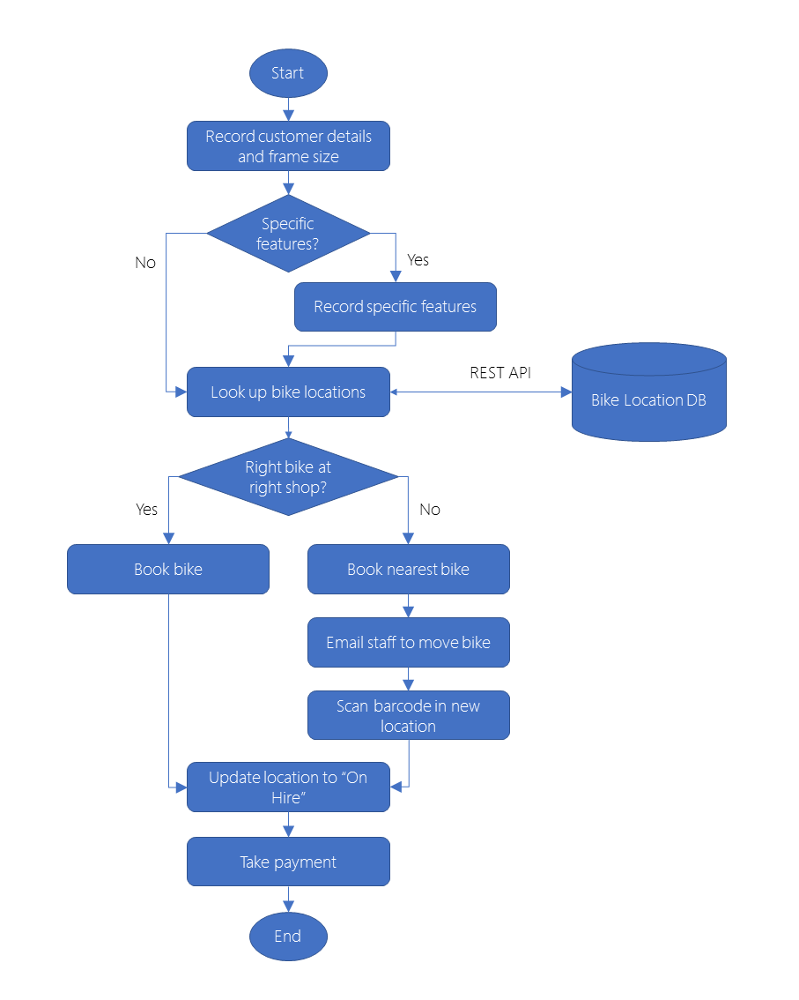

# Choose the best design-first technology to automate your business process

## Scenario

1. A customer requests a bike on the phone, in person, or through the website.
2. Shop staff record the customer's details and frame size.
3. Does the customer need specific features such as an electric motor, suspension, or a child trailer? If so what are those features?
4. Where are all the bikes with that frame size and those features? This information is obtained from the bike location database and is kept up-to-date by the barcode scanning system.
5. Is there a bike with the right features and frame size in the right shop? If yes book that bike.
   1. If not, where is the nearest bike? Reserve that bike.
   2. Send an email to staff to move the bike to the customer.
   3. Scan barcode in new location.
6. Give the bike to the customer and update location to "On Hire".
7. Take payment from the customer.
